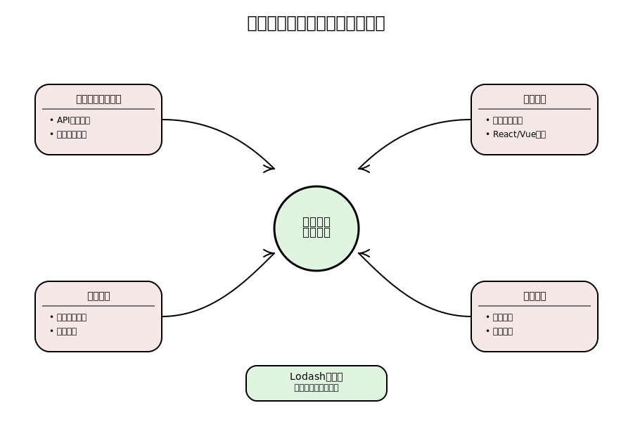
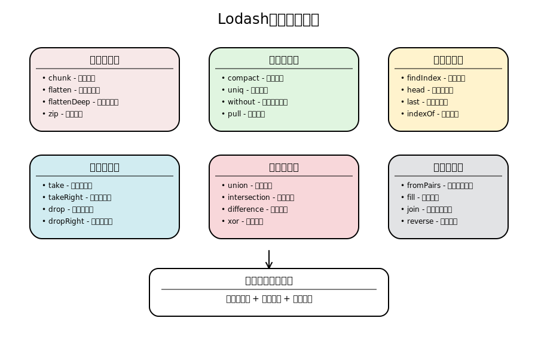
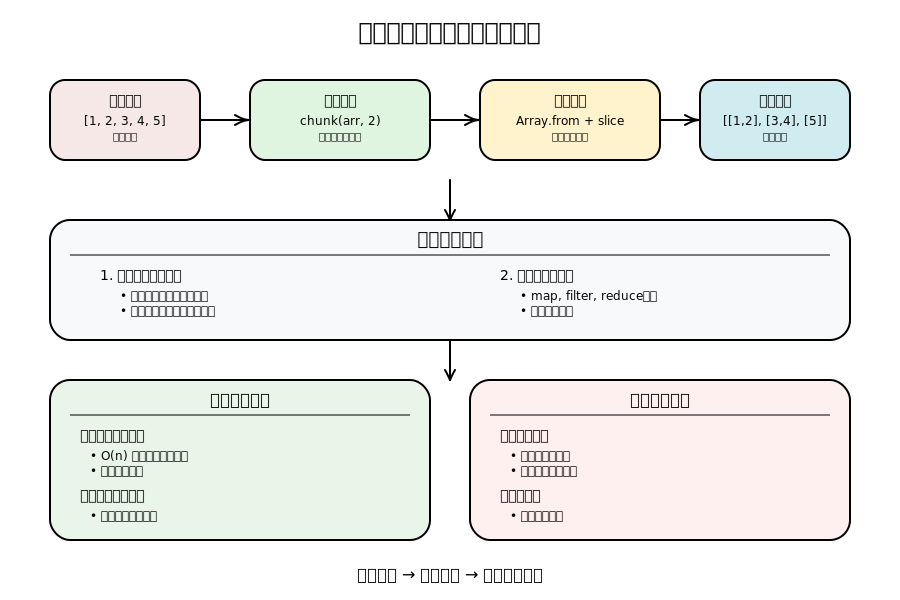

# 前端开发中的数组处理艺术：深入理解 Lodash 数组方法

## 引言：数组处理在前端开发中的重要性

在现代前端开发中，数据处理是核心技能之一。无论是处理 API 返回的数据、管理组件状态、还是实现复杂的业务逻辑，数组操作都扮演着至关重要的角色。一个优秀的前端开发者必须熟练掌握各种数组处理技巧，这不仅能提高开发效率，还能写出更加优雅和可维护的代码。

数组处理的重要性体现在以下几个方面：

1. **数据转换与格式化**：将后端返回的原始数据转换为前端组件需要的格式
2. **状态管理**：在 React、Vue 等框架中，数组状态的更新需要遵循不可变性原则
3. **性能优化**：合理的数组操作能够减少不必要的渲染和计算
4. **用户体验**：通过数组操作实现搜索、筛选、排序等功能，提升用户交互体验



Lodash 作为 JavaScript 生态系统中最受欢迎的工具库之一，提供了丰富而强大的数组处理方法。这些方法不仅功能完善，而且经过了大量的测试和优化，是前端开发者的得力助手。

## 核心数组方法详解

### 1. 数组分割与重组

#### chunk - 数组分块

将一个数组分成多个小数组，这在分页处理、批量操作等场景中非常有用。

```javascript
const chunk = (arr, size) =>
  Array.from({ length: Math.ceil(arr.length / size) }, (v, i) =>
    arr.slice(i * size, i * size + size)
  );

chunk(['a', 'b', 'c', 'd'], 2);
// => [['a', 'b'], ['c', 'd']]

chunk(['a', 'b', 'c', 'd'], 3);
// => [['a', 'b', 'c'], ['d']]
```

**实现思路**：根据指定的大小将数组切割成多个小数组，使用 ES6 的 Array.from()方法，创建一个长度为切割后数组个数的新数组，使用 slice()方法将原数组按照切割后的大小进行分割。

#### flatten - 数组扁平化

将多维数组转化为一维数组，在处理嵌套数据结构时特别有用。

```javascript
const flatten = arr => [].concat(...arr);

flatten([1, [2, [3, [4]], 5]]);
// => [1, 2, [3, [4]], 5]
```

#### flattenDeep - 深度扁平化

递归地将多维数组转化为一维数组。

```javascript
const flattenDeep = arr =>
  [].concat(...arr.map(v => (Array.isArray(v) ? flattenDeep(v) : v)));

flattenDeep([1, [2, [3, [4]], 5]]);
// => [1, 2, 3, 4, 5]
```

### 2. 数组过滤与清理

#### compact - 去除假值

去除数组中的假值（false、null、0、""、undefined、NaN），这是数据清理中的常用操作。

```javascript
const compact = arr => arr.filter(Boolean);

compact([0, 1, false, 2, '', 3]);
// => [1, 2, 3]
```

#### uniq - 数组去重

返回一个新数组，包含所有数组中的不重复元素。

```javascript
const uniq = arr => [...new Set(arr)];

uniq([2, 1, 2]);
// => [2, 1]
```

#### without - 排除指定元素

返回一个新数组，去掉原数组中指定的元素。

```javascript
const without = (arr, ...args) => arr.filter(item => !args.includes(item));

without([2, 1, 2, 3], 1, 2);
// => [3]
```

### 3. 数组查找与定位

#### findIndex - 查找元素索引

返回第一个符合条件的元素的下标。

```javascript
const findIndex = (arr, fn) => arr.findIndex(fn);

const users = [
  { user: 'barney', active: false },
  { user: 'fred', active: false },
  { user: 'pebbles', active: true },
];

findIndex(users, o => o.user === 'barney');
// => 0
```

#### head - 获取首元素

返回数组中的第一个元素。

```javascript
const head = arr => arr[0];

head([1, 2, 3]);
// => 1
```

#### last - 获取尾元素

返回数组中的最后一个元素。

```javascript
const last = arr => arr[arr.length - 1];

last([1, 2, 3]);
// => 3
```

### 4. 数组截取与提取

#### take - 从头部提取

返回一个新数组，包含原数组中前 n 个元素。

```javascript
const take = (arr, n = 1) => arr.slice(0, n);

take([1, 2, 3], 2);
// => [1, 2]
```

#### takeRight - 从尾部提取

返回一个新数组，包含原数组中后 n 个元素。

```javascript
const takeRight = (arr, n = 1) => arr.slice(-n);

takeRight([1, 2, 3], 2);
// => [2, 3]
```

#### drop - 从头部移除

返回一个新数组，去掉原数组中的前 n 个元素。

```javascript
const drop = (arr, n = 1) => arr.slice(n);

drop([1, 2, 3], 2);
// => [3]
```

#### dropRight - 从尾部移除

返回一个新数组，去掉原数组中的后 n 个元素。

```javascript
const dropRight = (arr, n = 1) =>
  n >= arr.length ? [] : arr.slice(0, arr.length - n);

dropRight([1, 2, 3], 2);
// => [1]
```



### 5. 数组合并与比较

#### concat - 数组合并

合并多个数组。

```javascript
const concat = (...args) => [].concat(...args);

const array = [1];
const other = concat(array, 2, [3], [[4]]);
// => [1, 2, 3, [4]]
```

#### union - 并集操作

返回一个新数组，包含所有数组中的不重复元素。

```javascript
const union = (...args) => [...new Set(args.flat())];

union([2], [1, 2]);
// => [2, 1]
```

#### intersection - 交集操作

返回一个数组，包含在所有数组中都存在的元素。

```javascript
const intersection = (...arr) => [
  ...new Set(arr.reduce((a, b) => a.filter(v => b.includes(v)))),
];

intersection([2, 1], [4, 2], [1, 2]);
// => [2]
```

#### difference - 差集操作

返回一个数组，包含在第一个数组中但不在其他数组中的元素。

```javascript
const difference = (arr, ...args) =>
  arr.filter(item => args.every(arg => !arg.includes(item)));

difference([3, 2, 1], [4, 2]);
// => [3, 1]
```

#### xor - 对称差集

返回一个新数组，包含只在其中一个数组中出现过的元素。

```javascript
const xor = (...args) =>
  args
    .flat()
    .filter(
      item => args.flat().indexOf(item) === args.flat().lastIndexOf(item)
    );

xor([2, 1], [2, 3]);
// => [1, 3]
```

### 6. 数组转换与重构

#### zip - 数组压缩

将多个数组的同一位置的元素合并为一个数组。

```javascript
const zip = (...arrays) =>
  arrays[0].map((_, i) => arrays.map(array => array[i]));

zip(['fred', 'barney'], [30, 40], [true, false]);
// => [['fred', 30, true], ['barney', 40, false]]
```

#### fromPairs - 键值对转对象

将一个二维数组转化为一个对象。

```javascript
const fromPairs = arr =>
  arr.reduce((obj, [key, val]) => ({ ...obj, [key]: val }), {});

fromPairs([
  ['a', 1],
  ['b', 2],
]);
// => { 'a': 1, 'b': 2 }
```

#### fill - 数组填充

用指定的值填充数组。

```javascript
const fill = (arr, value, start = 0, end = arr.length) =>
  arr.fill(value, start, end);

fill([4, 6, 8, 10], '*', 1, 3);
// => [4, '*', '*', 10]
```

## 高级数组处理技巧

### 条件化处理方法

#### differenceBy - 基于迭代器的差集

与 difference 类似，但是可以指定一个函数对比数组中的元素。

```javascript
const differenceBy = (array, values, iteratee) => {
  const fn = typeof iteratee === 'function' ? iteratee : item => item[iteratee];
  const valuesSet = new Set(values.map(fn));
  return array.filter(item => !valuesSet.has(fn(item)));
};

differenceBy([3.1, 2.2, 1.3], [4.4, 2.5], Math.floor);
// => [3.1, 1.3]
```

#### dropRightWhile - 条件化移除

返回一个新数组，去掉原数组中从最后一个符合条件的元素到结尾之间的元素。

```javascript
const dropRightWhile = (array, iteratee) => {
  let right = array.length - 1;
  if (typeof iteratee === 'function') {
    while (iteratee(array[right])) {
      right--;
    }
  }
  return array.slice(0, right + 1);
};

const users = [
  { user: 'barney', active: true },
  { user: 'fred', active: false },
  { user: 'pebbles', active: false },
];

dropRightWhile(users, o => !o.active);
// => objects for ['barney']
```



## 性能优化与最佳实践

### 1. 选择合适的方法

- 对于简单的数组操作，优先使用原生 JavaScript 方法
- 对于复杂的数据处理，使用 Lodash 方法可以提高代码可读性
- 在性能敏感的场景中，考虑使用专门优化的算法

### 2. 避免不必要的数组复制

- 使用`slice()`创建数组副本时要谨慎
- 考虑使用`splice()`进行原地修改（当不需要保持原数组时）
- 利用扩展运算符进行浅拷贝

### 3. 链式调用的优化

- 合理使用方法链，避免创建过多中间数组
- 在数据量大的情况下，考虑使用`reduce()`一次性完成多个操作

### 4. 内存管理

- 及时释放不再使用的大数组引用
- 使用`WeakMap`和`WeakSet`处理对象引用
- 避免在循环中创建大量临时数组

## 实际应用场景

### 1. 电商网站商品筛选

```javascript
// 根据多个条件筛选商品
const filterProducts = (products, filters) => {
  return products
    .filter(
      product => !filters.category || product.category === filters.category
    )
    .filter(product => !filters.minPrice || product.price >= filters.minPrice)
    .filter(product => !filters.maxPrice || product.price <= filters.maxPrice);
};
```

### 2. 数据报表生成

```javascript
// 将数据按时间分组并计算统计信息
const generateReport = data => {
  const grouped = groupBy(data, 'date');
  return Object.entries(grouped).map(([date, items]) => ({
    date,
    count: items.length,
    total: items.reduce((sum, item) => sum + item.amount, 0),
  }));
};
```

### 3. 表单数据处理

```javascript
// 清理和验证表单数据
const processFormData = formData => {
  return compact(
    Object.entries(formData)
      .map(([key, value]) => [
        key,
        typeof value === 'string' ? value.trim() : value,
      ])
      .filter(([key, value]) => value !== '')
  );
};
```

## 总结与展望

通过深入学习和掌握 Lodash 数组方法，前端开发者可以：

1. **提升开发效率**：使用经过优化的工具函数，减少重复代码编写
2. **提高代码质量**：利用函数式编程思想，编写更加简洁和可维护的代码
3. **增强问题解决能力**：面对复杂的数据处理需求时，能够快速找到合适的解决方案
4. **优化应用性能**：通过合理选择和使用数组方法，提升应用的运行效率

在现代前端开发中，数组处理能力已经成为衡量开发者技术水平的重要指标。掌握这些核心方法不仅能帮助我们更好地处理日常开发任务，还能为我们在面试和技术交流中增添底气。

随着 JavaScript 生态系统的不断发展，新的数组处理方法和模式也在不断涌现。作为前端开发者，我们需要保持学习的热情，持续关注和掌握最新的技术发展，让数组处理真正成为我们开发工具箱中最锋利的武器。

---

_本文基于 coding-interview-questions 项目中的 Lodash 实现，旨在帮助前端开发者深入理解数组处理的核心概念和实践技巧。_
